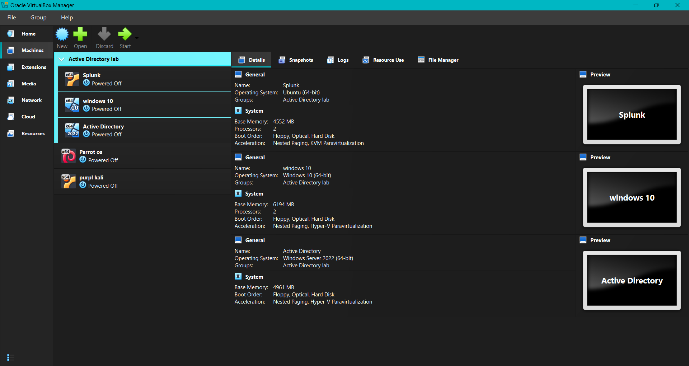

<p align="center">
  <a href="https://skillicons.dev">
    
    <h1 align="center">Active-Directory-lab </h1>
  </a>
</p>

<p align="center"></p> 

*Ref 1: Diagram*

## Objective

this lab simulates a real world enterprise network where I set up a whole soc lab to follow along to know more about this lab
<p>you can find here the <a href="https://youtu.be/5OessbOgyEo?si=TgaMxJH3zi4oQWGY">source link</a></p>

### Skills Learned


- Building a domain, managing users, and joining client VMs.
- Deploying Splunk and forwarding logs across multiple operating systems.
- Installing Microsoft Sysmon and configuring Windows audit policies.

### Tools Used


- Oracle VirtualBox.
- OpenSSH.
- Splunk Enterprise & Splunk Universal Forwarder.
- Microsoft Sysmon.

## Steps
### 1/ Planification
in this phase, I created the diagram in <a href="img/Active Directory lab.png">Ref 1</a> to  organize the lab structure, the lab contains 4 virtual machines :

<p align="center"></p>

*Ref 2: virtual machines*

- Ubuntu Server running Splunk Enterprise (SIEM).
- Windows Server 2022 that hosts Active Directory Domain Services.
- Windows 10 Enterprise, a corporate workstation joined to the active directory domain.
- Kali Linux used to conduct target discovery and brute-force attacks.

for the network part I created a virtualbox NAT  network with the IPv4 prefix of `192.168.10.0/24`.

After the conception of the diagram I started building the VMs using VirtualBox Hypervisor <a href="img/vms.png">ref 2</a>.

### 2/ SIEM setup
In this phase, I set up the Ubuntu server with the Splunk SIEM.

first I attributed the Splunk Server the static IP address `192.168.10.10` as shown in <a href="img/Splunk server setup.png">ref 3</a>.


*Ref 3: IP setup for ubuntu server*

after setting up a static IP address for the Ubuntu server, I launched the Windows 10 virtual machine and connected to the server via SSH, then I made a server update.

```bash
$ sudo apt update && sudo apt upgrade -y
```
after the update was finished, I installed Splunk Enterprise on the Ubuntu server <a href="img/splunk setup (2).png">ref 4</a>.


*Ref 4: Splunk setup*

now that Splunk is installed in the Ubuntu server we need to collect and ship local logs to the Splunk receivers (Windows 10 & Windows Server), and for that I set up Splunk Universal Forwarder in both machines.

in addition to that, we need an advanced host-level system monitor that records deep Windows system activity, process creations, and network events. Microsoft Sysmon will do the job for this task.

after this log setup we can access this beautiful Splunk dashboard by typing the Ubuntu server IP address in a web browser <a href="img/splunk dashboard.png">ref 5</a>.


*Ref 5: Splunk dashboard*

### 3/ Active Directory setup

This part will focus on Active Directory setup and user creation.

The IP address attributed for the Active Directory server is `192.168.10.7` as shown in <a href="img/AD ip config.png">ref 6</a>.


*Ref 6: IP setup for windows server*

After setting up the IP address, I started to create users for this lab. I created two custom domain controllers (HR & IT) and assigned one user for each domain as shown in the <a href="img/server manager.png">ref 7</a>.


*Ref 7: IP Server Manager*

after setting up the Windows server we move on to the client machine (Windows 10) to make it a member of the Active Directory Domain <a href="img/domain setup.png">ref 8</a>.


*Ref 8: Domain setup*

then adding remote users so that each user can access his session through his machine <a href="img/adding remote users .png">ref 9</a>.


*Ref 9: adding remote users*

finally we can connect to the user session <a href="img/connect to jsmith (2).png">ref 10</a>


*Ref 10: user connection*

### 4/ pentesting 

this phase is not yet finished; any update will be saved soon
